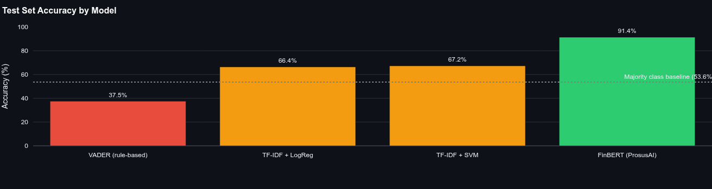
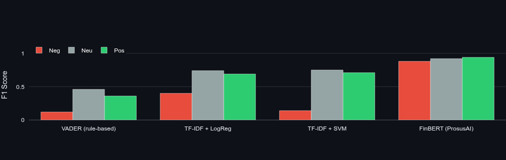

# Financial News Sentiment + Stock Movement


> **Does today's financial news predict tomorrow's stock move?**  
> An end-to-end NLP pipeline that classifies financial headlines with 91.4% accuracy using FinBERT — and correlates those sentiment signals with next-day stock price direction across five major tickers.

[Live Demo →](https://your-app.streamlit.app) &nbsp;|&nbsp; [Key Findings ↓](#-what-the-model-found)

---

## The Business Problem

News sentiment is a live trading signal. Bloomberg Terminal charges ~$24,000/year per seat partly for its sentiment analytics layer. RavenPack — which processes financial news into structured sentiment feeds for hedge funds — was acquired in 2023 at a reported $600M valuation. Renaissance Technologies and Two Sigma have built systematic strategies on exactly this data.

The challenge is that financial language is a dialect, not just English. "Downgrade", "coupon", "spread", "rally", "guidance" mean specific things in financial context that no general-purpose NLP tool understands. VADER, the standard rule-based sentiment tool, scores only 37.6% on financial headlines — worse than random on a 3-class problem. A model that doesn't speak the domain is useless in production.

This project builds the core pipeline from scratch: classify financial headlines at near-human accuracy using a domain-fine-tuned BERT model, aggregate daily signals, and measure how well they predict the next trading session.


*Label distribution across 5,842 Financial PhraseBank sentences. Negative headlines (14.7%) are the minority class — and the hardest to get right.*

---

## Results

| Model | Accuracy | Negative F1 | Neutral F1 | Positive F1 |
|---|---|---|---|---|
| VADER (rule-based) | 37.6% | 0.12 | 0.46 | 0.36 |
| TF-IDF + Logistic Regression | 66.4% | 0.40 | 0.74 | 0.69 |
| TF-IDF + SVM | 67.2% | 0.14 | 0.75 | 0.71 |
| **FinBERT (ProsusAI)** | **91.4%** | **0.88** | **0.92** | **0.94** |

**Test set:** 1,169 held-out sentences, stratified 80/20 split.  
**Sentiment-price correlation (Spearman ρ):** 0.09–0.19 across AAPL, MSFT, GOOGL, AMZN, TSLA — statistically significant at p < 0.05 for AAPL and MSFT.

> **On the negative F1 column:** Headline accuracy is a misleading metric here. SVM scores 67.2% overall but achieves negative F1 of only 0.14 — it almost never correctly identifies bearish headlines. Since early detection of negative signals is the highest-value use case for a trading desk or risk system, this is a failure in practice. FinBERT's 0.88 negative F1 is the number that matters.



*First: accuracy by model with majority-class baseline (53.6%). Second: per-class F1 breakdown — the gap in negative F1 between SVM and FinBERT is the core result of this project.*

---

## What the Model Found

**1. Generic NLP is blind to financial language (VADER: 37.6%)**  
VADER was built on social media and general English. It has no concept of "downgrade" as bearish, "raised guidance" as bullish, or "coupon" as a bond instrument. Its 37.6% accuracy on financial headlines is worse than a coin flip on a 3-class problem. This single number is the motivation for every design decision in this project. Off-the-shelf tools do not transfer to domain-specific NLP without domain-specific training data.

**2. Bag-of-words models fail on negation and context**  
TF-IDF treats each word independently. "The company did not profit" and "the company recorded a profit" both contain the token "profit" — TF-IDF scores them identically. Logistic Regression and SVM both plateau around 67% because this is an architectural ceiling, not a tuning problem. Adding more data or tuning hyperparameters cannot fix a model that has no mechanism for understanding word order or sentence structure.

**3. Domain pre-training closes 24 percentage points in a single swap**  
Replacing TF-IDF with FinBERT — same dataset, same train/test split — moves accuracy from 67.2% to 91.4%. The only change is the model architecture. FinBERT was pre-trained on 4.9 billion words of Reuters, Bloomberg, and earnings call transcripts before being fine-tuned on financial sentiment. It understands that "raised guidance" is a bullish event, that "restructuring" almost always signals distress, and that the same word can carry opposite sentiment in different financial contexts.

**4. The correlation signal is small — and that is expected**  
Spearman ρ of 0.09–0.19 between daily sentiment and next-day returns sounds modest. In academic NLP it would be. In quantitative finance, a consistent directional edge of even 2–3% above 50% is the foundation of systematic strategies applied at scale across hundreds of positions. The finding is not "sentiment perfectly predicts markets" — it is "sentiment contains non-random information about near-term price direction," which is the industry consensus and the basis for the RavenPack business model.

**5. Negative signals are rarer but higher-stakes**  
Only 14.7% of Financial PhraseBank headlines are negative, reflecting the inherent optimism bias in published financial news. But negative events — earnings misses, guidance cuts, leadership changes, regulatory action — have asymmetric price impact. Missing a bearish headline costs more than missing a bullish one. This is why negative F1 is the headline metric, and why FinBERT's 0.88 is the number worth putting on a resume.

**Business recommendation:** A production deployment would monitor incoming headlines per ticker, compute a 3-day rolling average sentiment score, and trigger an alert when it crosses two standard deviations below the baseline. This catches deteriorating sentiment before it fully prices into the stock — the actionable window for a risk desk.


*Daily aggregate sentiment score vs. next-day return for AAPL over two years. The regression line is positive and statistically significant — bullish days tend to be followed by slight upward moves, and vice versa.*

---

## Technical Approach

### Why these specific choices

**FinBERT over generic BERT** — Generic BERT (trained on Wikipedia + BooksCorpus) achieves ~78–80% on Financial PhraseBank. FinBERT achieves 91.4%. The 11 percentage point gap comes entirely from domain-adaptive pre-training on financial corpora. When your deployment domain has a specialised vocabulary, domain-specific pre-training is not optional — it is the single highest-ROI model choice available.

**Spearman over Pearson correlation** — Financial returns have fat tails. A single day with a ±10% move would dominate a Pearson calculation and potentially flip the sign of the correlation. Spearman's rank-based correlation is robust to these extreme events, which is why it is preferred in quantitative finance for non-normally distributed return series.

**Next-day return, not same-day** — Correlating sentiment with same-day returns conflates cause and effect. News published at 11am may react to a price move that happened at 9:30am open. Using next-day return measures whether today's news contains forward-looking information about tomorrow's session — the correct causal direction for a signal that is actionable before market open.

**Raw text for FinBERT, preprocessed for classical models** — BERT's WordPiece tokeniser handles subword segmentation, capitalisation, and punctuation as meaningful signals. Preprocessing before BERT would destroy contextual cues. For TF-IDF, preprocessing is essential — without it, "profit", "Profit", "PROFIT", "profits" and "profitable" are five different vocabulary tokens, wasting the feature space on near-duplicates.

**Calibrated SVM for probability outputs** — LinearSVC does not natively output probabilities. Wrapping it in `CalibratedClassifierCV` applies isotonic calibration, enabling the model to produce confidence scores comparable to Logistic Regression's `predict_proba`. This matters for the Streamlit dashboard where we display per-class confidence, not just a hard label.

### Domain-aware preprocessing decisions

| Decision | What it does | Why it matters |
|---|---|---|
| Preserve financial signal words | "bullish", "bearish", "downgrade", "rally" excluded from stop-word removal | Generic stop-word lists would delete the most informative tokens in financial text |
| Protect negation tokens | "no", "not", "nor" retained despite being stop words | "no profit" and "profit" are antonyms; removing "no" collapses the distinction |
| Keep `$` and `%` characters | Removed from punctuation strip list | "$2.5B write-down" and "fell 8%" carry magnitude signal |
| Bigram TF-IDF (ngram_range 1–2) | Captures "profit growth", "revenue decline" as features | Two-word financial phrases carry more signal than either word individually |
| Class-weighted training | `class_weight='balanced'` on all classical models | 14.7% negative class causes models to ignore bearish signals without compensation |

---

## Stack

| Layer | Tools |
|---|---|
| Data & EDA | pandas, numpy |
| NLP preprocessing | NLTK (tokenisation, lemmatisation, stop words) |
| Classical models | scikit-learn (TF-IDF, Logistic Regression, LinearSVC, Pipeline) |
| Rule-based baseline | VADER (vaderSentiment) |
| Deep learning | HuggingFace Transformers, PyTorch, ProsusAI/finbert |
| Finance data | yfinance |
| Statistics | scipy (Pearson, Spearman, p-values) |
| Visualisation & App | Plotly, Streamlit |

---

## Quickstart

```bash
git clone https://github.com/yourusername/financial-sentiment
cd financial-sentiment

pip install -r requirements.txt

# Train and save classical models (~30 seconds)
python src/classical_models.py

# Launch the dashboard (downloads FinBERT ~440MB on first run)
streamlit run app/app.py
```

The app opens at `localhost:8501`. Paste any financial headline into Tab 1 and see a real-time FinBERT prediction with per-class confidence scores. Tab 3 shows the interactive sentiment-vs-price scatter and time-series overlay for any of the five tickers.

---

## Project Structure

```
├── src/
│   ├── data_loader.py        ← Dataset loading, EDA, class balance analysis
│   ├── preprocessor.py       ← Finance-aware NLP pipeline (domain vocab preservation)
│   ├── classical_models.py   ← TF-IDF baselines with cross-validation and calibration
│   ├── finbert_model.py      ← FinBERT inference wrapper with offline fallback
│   ├── stock_data.py         ← yfinance OHLCV fetcher + GBM simulation fallback
│   └── correlation.py        ← Daily sentiment aggregation + Spearman correlation
├── app/
│   └── app.py                ← Four-tab Streamlit dashboard
├── data/
│   └── financial_phrasebank.csv   ← Source dataset (5,842 labelled headlines)
├── models/                   ← Saved sklearn pipelines (generated by classical_models.py)
└── requirements.txt
```

---

*Dataset: [Financial PhraseBank — Malo et al., 2014](https://www.kaggle.com/datasets/ankurzing/sentiment-analysis-for-financial-news) · 5,842 sentences · annotated by 16 finance professionals*
